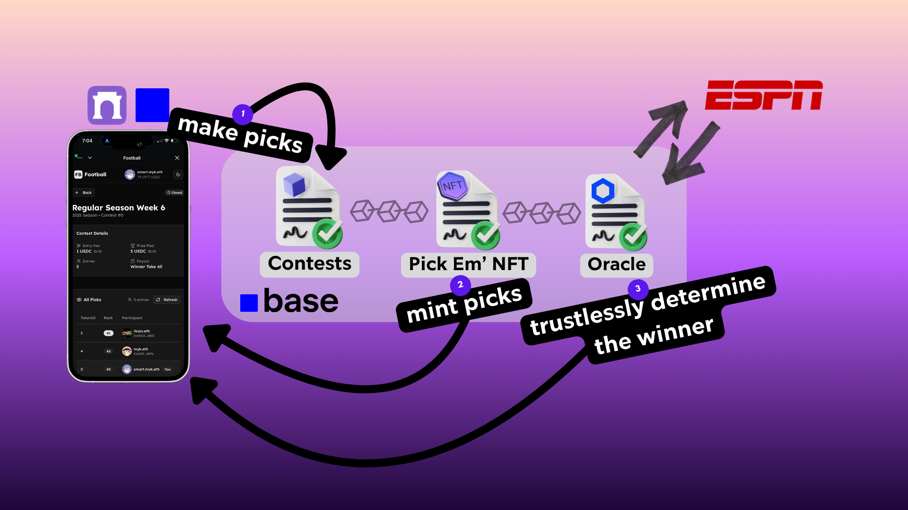

# Football Pick Em



NFL Pick'em contests where users mint NFTs representing their predictions. Each NFT contains picks for all games in a week. Winners are determined by most correct picks, with prizes distributed on-chain.

## How It Works

### Smart Contracts

**Pickem** - Main contest contract. Users enter contests by paying an entry fee and submitting predictions (stored as NFTs). After games complete, the contract calculates scores and distributes the prize pool to winners based on configurable payout structures (winner-take-all, top-3, or top-5).

**PickemNFT** - ERC721 contract that represents each user's predictions as an NFT. The NFT metadata includes the contest details, picks for each game, and the current score once games are finalized.

**GameScoreOracle** - Chainlink Functions oracle that fetches game results from ESPN's API. Returns winner, total points, and quarter-by-quarter scores for tiebreaker resolution.

Prize distribution uses a 24-hour delay after games finalize to ensure oracle data is accurate. Treasury takes a 2% fee on entry amounts.

#### Deploy Contracts

```bash
cd solidity
RPC_URL=YOUR_RPC_URL PRIVATE_KEY=YOUR_PRIVATE_KEY make deploy-base && make verify-contracts-base
```

#### Run Tests

```bash
forge test -vv
```

### Frontend & APIs

**Next.js App** - Server-rendered pages for creating contests, viewing leaderboards, and making picks. Uses Thirdweb SDK for wallet connections and contract interactions.

**API Routes**:

- `/api/contest/[contestId]` - Fetches contest data from blockchain
- `/api/contest/[contestId]/live-rankings` - Real-time leaderboard with cached game results
- `/api/games` - ESPN game data (teams, times, scores)
- `/api/og/pickem/[contestId]` - Dynamic OG images for social sharing
- `/api/tokens` - Token price/metadata for payment options

**Key Features**:

- Thirdweb embedded wallets (email, social, passkey login)
- Real-time score updates via Redis caching
- Dynamic metadata for SEO and social sharing
- Multi-token support for entry fees (ETH, USDC, etc.)

## Development

```bash
bun install
bun dev
```

Open [http://localhost:3000](http://localhost:3000)

## Environment Variables

Copy `env.example` to `.env.local`:

```bash
# Thirdweb
NEXT_PUBLIC_THIRDWEB_CLIENT_ID=
THIRDWEB_SECRET_KEY=

# Base Sepolia or Base Mainnet RPC
NEXT_PUBLIC_RPC_URL=

# Redis (for caching game data)
REDIS_URL=

# Contract addresses
NEXT_PUBLIC_PICKEM_ADDRESS=
NEXT_PUBLIC_PICKEM_NFT_ADDRESS=
```

## Deployment

The app runs on Vercel. Contracts are deployed via Foundry scripts in `/solidity`.

See `REDIS_SETUP.md` for cache configuration and `SCORING_MECHANISM.md` for detailed payout logic.
